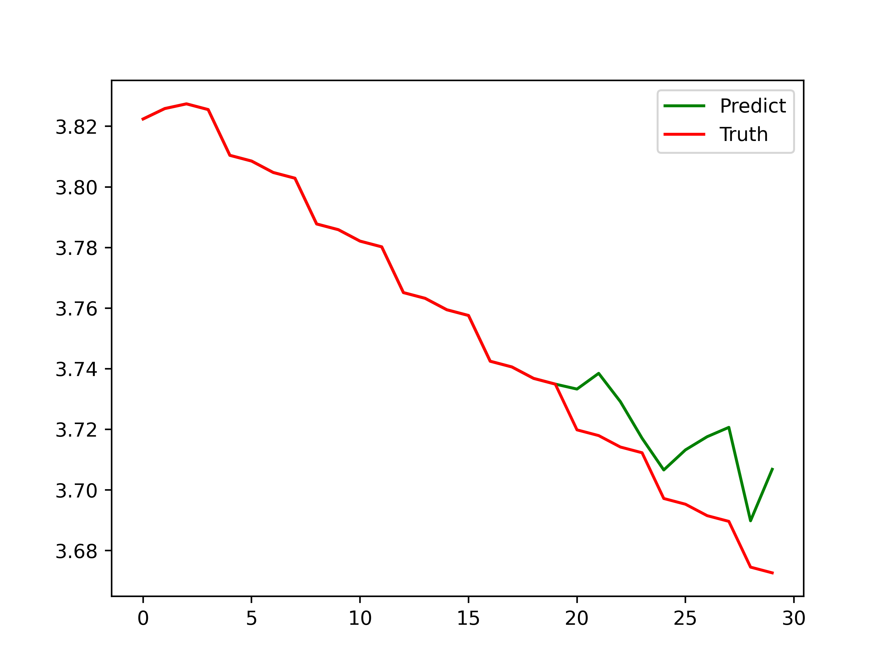
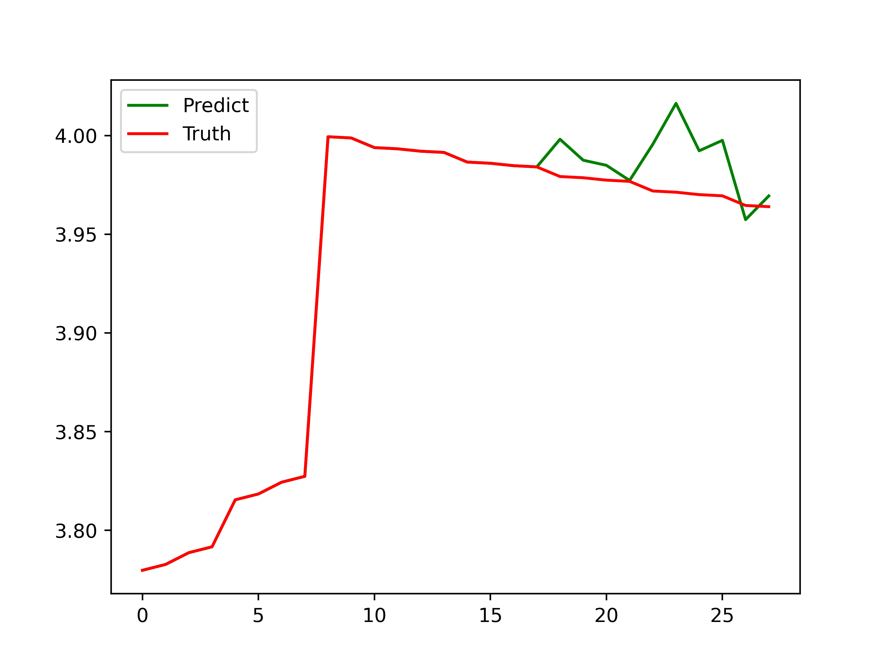
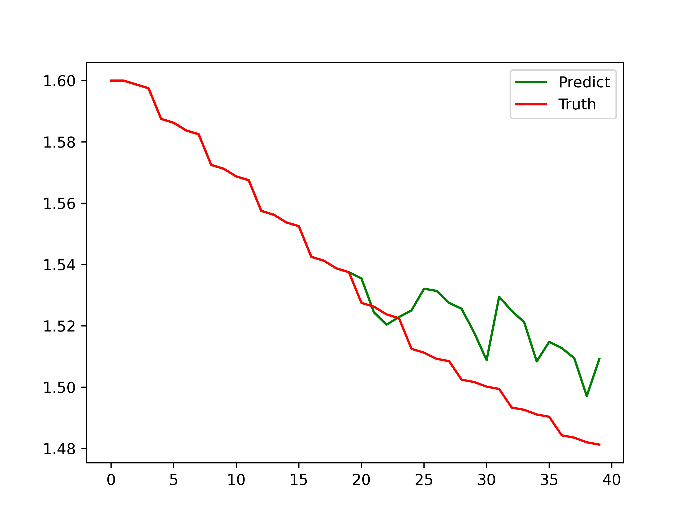
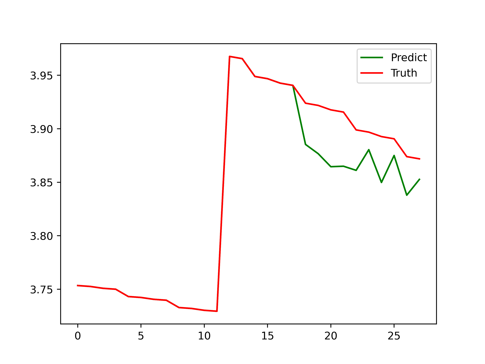

# 智慧种植 —— 番茄生长状态预测

## 模型

在本次项目中，我们采用的是CNN+LSTM的模型结果，其中CNN用于提取图像的图片，然后和传感器特征向量拼接在一起，再使用LSTM对时序数据进行预测。在本模型中，输入的是`['图像', '土壤水分%', '土壤温度℃', '叶面积', '叶夹角','高度', 'RVI', 'LNC', 'LNA', 'LAI']`，输出的是植株的叶面积指数`LAI`；

## 数据对齐

在本项目中，共有九次仪器采集的植株生长状态指标，但是由于前两次缺少部分数据，在本项目中并未采用该时间段的数据；然后根据牛顿插值算法对数据按照一小时的时间间隔单位进行插值，并将其和传感器数据进行对齐。除此之外，由于图片数据是每天四张，分别在08、10、14、16这几个时间进行采集，因此还需要对图片进行增广操作。在这里，我们使用调整亮度的方式增加图片数据:

```Python
img1 = cv.imread(img1_path)
img2 = cv.imread(img2_path)
img1_beta = np.mean(img1)
img2_beta = np.mean(img2)
div = int(tmp2[2])-int(tmp1[2])
for i in range(div-1):
    img3 = cv.convertScaleAbs(img1, beta=(i+1)*(img2_beta-img1_beta)/div, alpha=1)
    cv.imwrite("./dataset/png/{}/{}_{}_{:0>2}.jpg".format(imgDir, tmp1[0], tmp1[1], int(tmp1[2])+i+1), img3)
```

分别计算两张图片之间的均值，然后根据生成的图片数量，使用`cv.convertScaleAbs()`对原图进行亮度的调整。

## 实验结果

下面是一些预测结果图：







